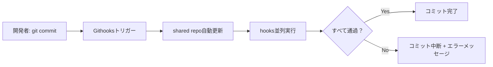

# shared-githooks

[Githooks](https://github.com/gabyx/Githooks)を通じて複数のリポジトリで共有できるGit hooksコレクションです。

**[English](README.md)** | **[한국어](README.ko.md)**

## なぜ使うべきか？

チームで複数のリポジトリを管理する際、各リポジトリごとにGit hooksを個別管理すると
以下の問題が発生します：

- **ルールの断片化:** リポジトリごとに異なるチェックレベルが適用され、
  コード品質が不均一になる
- **メンテナンス負担:** 同じhookをN個のリポジトリにコピー＆ペーストし、
  変更時にすべて手動更新が必要
- **オンボーディングコスト:** 新しいメンバーがプロジェクトごとに異なる
  hook設定を把握する必要がある

shared-githooksはこれらの問題を解決します：

- **一元管理** — hookを一箇所で管理し、すべてのリポジトリが自動的に最新
  バージョンを使用
- **ワンライン設定** — `.shared.yaml`にURL一行を追加するだけで全hookセットを適用
- **選択的適用** — ネームスペースとignoreパターンでリポジトリごとの細かい制御が可能

## 主要機能

### Pre-commit Hooks（6種）

| Hook | 説明 |
|------|------|
| `check.sh` | Makefileの`check`ターゲットを実行（フォーマットチェック + リント） |
| `check-whitespace.sh` | trailing whitespaceなどの空白エラーを検出 |
| `check-non-ascii.sh` | 非ASCIIファイル名を拒否（クロスプラットフォーム互換性） |
| `lint-go.sh` | `golangci-lint`を実行（Goプロジェクト） |
| `lint-org.sh` | `org-lint`を実行（Org-modeファイル） |
| `test-bazel.sh` | 変更の影響を受けるBazelテストを選択的に実行 |

### Commit-msg Hooks（3種）

| Hook | 説明 |
|------|------|
| `check-subject-length.sh` | コミットタイトル72文字制限 |
| `check-co-authored-by.sh` | `Co-Authored-By:`行を拒否 |
| `check-generated-comment.sh` | AI生成マーカー（`Generated with `）を拒否 |

### 設計特性

- **並列実行** — `checks/`ディレクトリ内のhooksが同時に実行され高速
- **グレースフルデグレデーション** — 依存ツールがない場合、失敗せずスキップ
- **重複防止** — Makefileが同じツールを既に実行している場合、自動スキップ
- **クロスプラットフォーム** — `#!/usr/bin/env bash`ベースでmacOS/Linux互換

## 動作原理



1. 利用リポジトリの`.githooks/.shared.yaml`にこのリポジトリのURLを登録
2. Githooksがこのリポジトリを自動的にクローン／更新
3. Gitイベント（commit、pushなど）発生時、該当hookディレクトリのスクリプトを
   並列実行
4. いずれかが失敗した場合、Git操作を中断しエラーメッセージを表示

## クイックスタート

### 1. Githooksのインストール

```bash
brew install gabyx/githooks/githooks
git hooks install
```

### 2. プロジェクトに適用

`.githooks/.shared.yaml`に追加：

```yaml
urls:
  - "https://github.com/jaeyeom/shared-githooks.git@main"
```

またはグローバル設定：

```bash
git config --global githooks.shared "https://github.com/jaeyeom/shared-githooks.git@main"
```

## ドキュメント

| ドキュメント | 説明 |
|-------------|------|
| [はじめに](docs/ja/getting-started.md) | インストール、設定、バージョン固定 |
| [Hooksリファレンス](docs/ja/hooks-reference.md) | すべてのhookの詳細な動作と条件 |
| [設定ガイド](docs/ja/configuration.md) | ネームスペース、無効化、環境変数、コンテナ |
| [開発ガイド](docs/ja/development.md) | 新しいhookの追加、コーディング規約、テスト |

## 開発

ツールのインストール：

```bash
brew install shfmt shellcheck yamllint biome
```

フォーマットとリント：

```bash
make          # format + lint
make check    # CI用チェック（ファイル変更なし）
make help     # 利用可能なターゲットを表示
```
