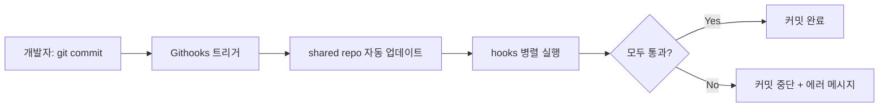

# shared-githooks

[Githooks](https://github.com/gabyx/Githooks)를 통해 여러 저장소에서 공유할 수 있는 Git hooks 모음입니다.

**[English](README.md)** | **[日本語](README.ja.md)**

## 왜 사용해야 하나요?

팀에서 여러 저장소를 관리할 때, 각 저장소마다 Git hooks를 개별 관리하면 다음
문제가 발생합니다:

- **규칙 파편화:** 저장소마다 서로 다른 검사 수준이 적용되어 코드 품질이
  불균일해짐
- **유지보수 부담:** 동일한 hook을 N개 저장소에 복사/붙여넣기하고, 변경 시
  모두 수동 업데이트
- **온보딩 비용:** 새 팀원이 프로젝트별로 다른 hook 설정을 파악해야 함

shared-githooks는 이 문제들을 해결합니다:

- **중앙 집중 관리** — hook을 한 곳에서 관리하고, 모든 저장소가 자동으로
  최신 버전을 사용
- **설정 한 줄** — `.shared.yaml`에 URL 한 줄 추가로 전체 hook 세트 적용
- **선택적 적용** — 네임스페이스와 ignore 패턴으로 저장소별 세밀한 제어 가능

## 주요 기능

### Pre-commit Hooks (6종)

| Hook | 설명 |
|------|-----|
| `check.sh` | Makefile `check` 타겟 실행 (포맷 검사 + 린트) |
| `check-whitespace.sh` | trailing whitespace 등 공백 오류 검출 |
| `check-non-ascii.sh` | 비ASCII 파일명 거부 (크로스 플랫폼 호환성) |
| `lint-go.sh` | `golangci-lint` 실행 (Go 프로젝트) |
| `lint-org.sh` | `org-lint` 실행 (Org-mode 파일) |
| `test-bazel.sh` | 변경에 영향받는 Bazel 테스트 선택적 실행 |

### Commit-msg Hooks (3종)

| Hook | 설명 |
|------|-----|
| `check-subject-length.sh` | 커밋 제목 72자 제한 |
| `check-co-authored-by.sh` | `Co-Authored-By:` 줄 거부 |
| `check-generated-comment.sh` | AI 생성 마커 (`Generated with `) 거부 |

### 설계 특성

- **병렬 실행** — `checks/` 디렉토리 내 hooks가 동시에 실행되어 빠름
- **그레이스풀 디그레이데이션** — 의존 도구가 없으면 실패 없이 건너뜀
- **중복 방지** — Makefile이 이미 같은 도구를 실행하면 자동 스킵
- **크로스 플랫폼** — `#!/usr/bin/env bash` 기반으로 macOS/Linux 호환

## 작동 원리



1. 소비 저장소의 `.githooks/.shared.yaml`에 이 저장소 URL을 등록
2. Githooks가 이 저장소를 자동으로 클론/업데이트
3. Git 이벤트(commit, push 등) 발생 시 해당 hook 디렉토리의 스크립트를
   병렬 실행
4. 하나라도 실패하면 Git 동작을 중단하고 에러 메시지 표시

## 빠른 시작

### 1. Githooks 설치

```bash
brew install gabyx/githooks/githooks
git hooks install
```

### 2. 프로젝트에 적용

`.githooks/.shared.yaml` 파일에 추가:

```yaml
urls:
  - "https://github.com/jaeyeom/shared-githooks.git@main"
```

또는 글로벌 설정:

```bash
git config --global githooks.shared "https://github.com/jaeyeom/shared-githooks.git@main"
```

## 문서

| 문서 | 설명 |
|------|-----|
| [시작하기](docs/ko/getting-started.md) | 설치, 설정, 버전 고정 |
| [Hooks 레퍼런스](docs/ko/hooks-reference.md) | 모든 hook의 상세 동작과 조건 |
| [설정 가이드](docs/ko/configuration.md) | 네임스페이스, 비활성화, 환경변수, 컨테이너 |
| [개발 가이드](docs/ko/development.md) | 새 hook 추가, 코딩 규칙, 테스트 |

## 개발

도구 설치:

```bash
brew install shfmt shellcheck yamllint biome
```

포매팅과 린트:

```bash
make          # format + lint
make check    # CI용 검사 (파일 변경 없음)
make help     # 사용 가능한 타겟 표시
```
