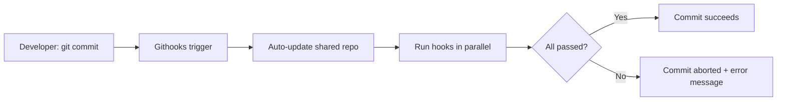

# shared-githooks

A collection of shared Git hooks for use with [Githooks](https://github.com/gabyx/Githooks) across multiple repositories.

**[한국어](README.ko.md)** | **[日本語](README.ja.md)**

## Why Use This?

When managing multiple repositories in a team, maintaining Git hooks
individually per repository leads to the following problems:

- **Fragmented rules:** Different levels of checks across repositories result
  in inconsistent code quality
- **Maintenance burden:** Copy-pasting the same hooks to N repositories, then
  manually updating all of them on every change
- **Onboarding cost:** New team members must learn different hook setups for
  each project

shared-githooks solves these problems:

- **Centralized management** — Manage hooks in one place; all repositories
  automatically use the latest version
- **One-line setup** — Add a single URL to `.shared.yaml` to apply the full
  hook set
- **Selective application** — Fine-grained per-repository control via
  namespaces and ignore patterns

## Key Features

### Pre-commit Hooks (6)

| Hook | Description |
|------|-------------|
| `check.sh` | Runs Makefile `check` target (format checks + lint) |
| `check-whitespace.sh` | Detects trailing whitespace and similar errors |
| `check-non-ascii.sh` | Rejects non-ASCII filenames (cross-platform compatibility) |
| `lint-go.sh` | Runs `golangci-lint` (Go projects) |
| `lint-org.sh` | Runs `org-lint` (Org-mode files) |
| `test-bazel.sh` | Selectively runs affected Bazel tests |

### Commit-msg Hooks (3)

| Hook | Description |
|------|-------------|
| `check-subject-length.sh` | Enforces 72-character subject line limit |
| `check-co-authored-by.sh` | Rejects `Co-Authored-By:` lines |
| `check-generated-comment.sh` | Rejects AI-generated markers (`Generated with `) |

### Design Characteristics

- **Parallel execution** — Hooks in `checks/` directories run concurrently
- **Graceful degradation** — Silently skips when dependencies are missing
- **Deduplication** — Auto-skips if Makefile already runs the same tool
- **Cross-platform** — macOS/Linux compatible via `#!/usr/bin/env bash`

## How It Works



1. Register this repository's URL in the consuming repo's
   `.githooks/.shared.yaml`
2. Githooks automatically clones/updates this repository
3. On Git events (commit, push, etc.), scripts in the corresponding hook
   directory run in parallel
4. If any hook fails, the Git operation is aborted with an error message

## Quick Start

### 1. Install Githooks

```bash
brew install gabyx/githooks/githooks
git hooks install
```

### 2. Add to Your Project

Add to `.githooks/.shared.yaml`:

```yaml
urls:
  - "https://github.com/jaeyeom/shared-githooks.git@main"
```

Or configure globally:

```bash
git config --global githooks.shared "https://github.com/jaeyeom/shared-githooks.git@main"
```

## Documentation

| Document | Description |
|----------|-------------|
| [Getting Started](docs/getting-started.md) | Installation, setup, version pinning |
| [Hooks Reference](docs/hooks-reference.md) | Detailed behavior and conditions for all hooks |
| [Configuration Guide](docs/configuration.md) | Namespaces, disabling hooks, environment variables, containers |
| [Development Guide](docs/development.md) | Adding new hooks, coding conventions, testing |

Translations: [한국어](docs/ko/) | [日本語](docs/ja/)

## Development

Install tools:

```bash
brew install shfmt shellcheck yamllint biome
```

Formatting and linting:

```bash
make          # format + lint
make check    # CI-friendly checks (no mutation)
make help     # show all targets
```
